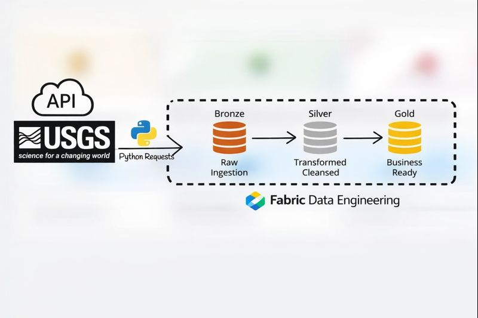
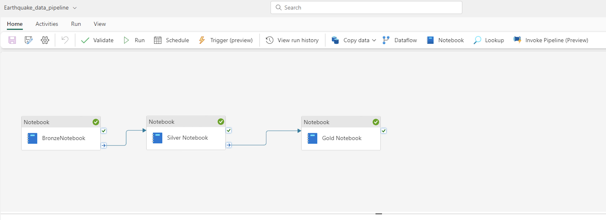

## Earthquake-Analytics-Microsoft-Fabric
This project uses the USGS Earthquake API to build an end to end data solution using Fabric Data Engineering

### Tools Used :
###### Data Pipeline
###### Notebooks
###### OneLake
###### PowerBI 

### Project Architecture sharing below:

#### Here is the data pipeline screenshot

#### Here is the Power BI Report

